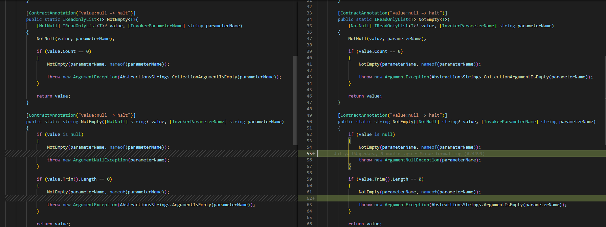

No últimos dias estou tentando aprimorar minhas habilidades de engenharia de software para construir aplicações robustas, de fácil manutenção, baixo acoplamento e alta coesão.

Pra isso, decidi analisar bibliotecas famosas para entender os pontos positivos e aplicá-las em meus softwares. Eu sei que cada projeto tem sua particularidade, mas análise de código também é algo importante para qualquer programador.

Hoje vamos estudar o framework <a href="https://github.com/dotnet/efcore">Entity Core</a>, um ORM bem famoso no ambiente .NET.

## DbContext.cs
`DbContext` é a classe principal do EF e nela definimos vários `DbSet<>` para realizar operações de update/delete/create no banco de dados.

`src/EFCore/DbContext.cs`
```csharp
namespace Microsoft.EntityFrameworkCore;

public class DbContext :
    IInfrastructure<IServiceProvider>,
    IDbContextDependencies,
    IDbSetCache,
    IDbContextPoolable
{
    private readonly DbContextOptions _options;

    private IDictionary<(Type Type, string? Name), object>? _sets;
    private IDbContextServices? _contextServices;
    private IDbContextDependencies? _dbContextDependencies;
    private DatabaseFacade? _database;
    private ChangeTracker? _changeTracker;
    
    /* ... */

    public DbContext(DbContextOptions options)
    {
        Check.NotNull(options, nameof(options));
        /* ... */
    }

    IDbSetSource IDbContextDependencies.SetSource
        => DbContextDependencies.SetSource;

    public virtual ChangeTracker ChangeTracker 
        => _changeTracker ??= InternalServiceProvider.GetRequiredService<IChangeTrackerFactory>().Create();

    /* ... */

    object IDbSetCache.GetOrAddSet(IDbSetSource source, Type type) { }

    /* ... */

    object IDbSetCache.GetOrAddSet(IDbSetSource source, string entityTypeName, Type type) { }

    /* ... */
}
```

## Analisando DbContext.cs:
- <b>Princípio da Segregação de Interface:</b> A classe DbContext já trabalhou nesse princípio e dividiu suas interfaces em várias partes, cada uma com sua responsabilidade, e não ficou apenas em uma interface "gorda".
- O namespace já foi declarado com a nova sintaxe do C# 10, fiz uma pesquisa rápida e no dia 21/Nov/2021 foi feito um <a href="https://github.com/dotnet/efcore/pull/26774">Pull Request</a> refatorando todos os namespaces do projeto.
- Todos os métodos (e até propriedades!) das interfaces, <a href="https://docs.microsoft.com/pt-br/dotnet/csharp/programming-guide/interfaces/explicit-interface-implementation">foram implementadas explicitamente!</a>
- Propriedades declaradas em interfaces apenas como `{ get }` já estão sendo implementadas utilizando a nova sintaxe de lambda para propriedades read-only.
- Propriedades são declaradas com tipos estáticos como interfaces ou classes abstrata e futuramente são atribuídas com classes concretas que implementam essas interfaces ou herdam de classes abstratas.
> “An abstraction should not depend upon details, but details should depend upon abstractions. When you declare variables, you should always use static types such as an interface or abstract class. Concrete classes that implement the interface or inherit from the abstract class can then be assigned to the variable.” - Jason Alls
- Variáveis privadas começa com o prefixo "_", seguindo as <a href="https://docs.microsoft.com/en-us/dotnet/csharp/fundamentals/coding-style/coding-conventions">convenções de código da Microsoft</a>.
- `_options` é marcado como `readonly` por ser atribuido apenas no construtor.
- Alguns métodos `private` não contém comentários, por quê?
- No construtor foi utilizado o método `Check.NotNull()` para verificar se o argumento `options` não é nulo, sem ele a biblioteca não funcionaria. Em primeiro momento, pensei que a classe `Check` era de terceiros, mas não, eles mesmos criaram essa classe estática que faz a verificação de vários valores.

## Check.cs:

`src/Shared/Check.cs`
```csharp
namespace Microsoft.EntityFrameworkCore.Utilities;

internal static class Check
{
    /* ... */
    public static T NotNull<T>(string parameterName) { }

    /* ... */
    public static IReadOnlyList<T> NotEmpty<T>(string parameterName) { }

    /* ... */
    public static string NotEmpty(string? value, string parameterName)
    { }
}
```
## Analisando Check.cs:
- A classe foi organizada dentro do namespace `Utilities`. Pesquisei no Google e a biblioteca Azure SDK <a href="https://github.com/Azure/azure-sdk-for-net/blob/main/sdk/mgmtcommon/Auth/Az.Auth/Az.Authentication/Utilities/Check.cs">fez algo parecido (até o nome do namespace é igual)!</a> 
- O arquivo da classe foi criada fora do EFCore, ela fica dentro da pasta "Shared".
- <b>Princípio da Responsabilidade Única:</b> a classe só tem um objetivo: verificar por valores nulos ou vazios.
- A classe é estática e não contém propriedades ou campos estáticos, o que evita memory leak, ponto positivo!
> “Any object that is referenced by a static variable is marked as not to be collected by the garbage collector. This is because static variables that reference objects are Garbage Collection (GC) roots, and anything that is a GC root is marked by the garbage collector as do not collect.” - Jason Alls
- Os métodos não têm comentários, ponto negativo.
- Linhas em branco importam para separar lógicas! Repare que fizeram commits apenas para inserir uma linha em branco antes do lançamento de uma exception.


## DbSet\<TEntity\>.cs

`DbSet` é utilizado para criar consultas ou salvar instâncias de entidades que serão traduzidas para queries no banco de dados.

Veja um exemplo de contexto, isso desperta minha curiosidade, como é feita a captura das propriedades do tipo DbSets<> na classe base DbContext?

`src/EFCore/DbSet.cs`
```csharp
public class SampleContext : DbContext
{
    public DbSet<Book> Books { get; set; }
    public DbSet<Author> Authors { get; set; }
}
``` 

## DbSetFinder

DbSetFinder, como o nome diz, é responsável por procurar propriedadades `DbSet<TEntity>` em classes que herdam de `DbContext.cs`.

Pra isso, o pessoal do EFCore criou a interface `IDbSetFinder` e a classe `DbSetFinder` implementa essa interface.

`src/EFCore/Infrastructure/IDbSetFinder.cs`
```csharp
namespace Microsoft.EntityFrameworkCore.Infrastructure;

public interface IDbSetFinder
{
    IReadOnlyList<DbSetProperty> FindSets(Type contextType);
}

```

`src/EFCore/Infrastructure/Internal/DbSetFinder.cs`
```csharp
namespace Microsoft.EntityFrameworkCore.Infrastructure.Internal;

public class DbSetFinder : IDbSetFinder
{
    /* ... */
    public virtual IReadOnlyList<DbSetProperty> FindSets(Type contextType)
        => _cache.GetOrAdd(contextType, FindSetsNonCached);

    /* ... */
    private static DbSetProperty[] FindSetsNonCached(Type contextType)
    {
        /* ... */
        return contextType.GetRuntimeProperties()./* ... */.ToArray();
    }
}
```

## Analisando

- Os nomes são legíveis, compreensíveis para humanos e significativos em relação à intenção do código, mas curtos o suficiente para não irritar outros programadores.
- `ConcurrentDictionary` é instânciado utilizando a nova expressão de invocação do construtor disponível na versão 9.0 do C#.
- Para capturar todas as propriedades, o EFCore faz uso de Reflection e LINQ.
> “The code should be checked to see whether the naming conventions have been followed for
the various code constructs, such as classes, interfaces, member variables, local variables,
enumerations, and methods. Nobody likes cryptic names that are hard to decipher,
especially if the code base is large. As the reviewer, you must be able to read the code and understand it. If the code is difficult to read and understand, then it really needs to be refactored before being merged.” - Jason Alls

## DbSetInitializer

Ao invés do DbSetFinder ser chamado no DbContext, uma outra classe faz essa mediação: a `DbSetInitializer`.

`src\EFCore\Internal\IDbSetInitializer.cs`
```csharp
namespace Microsoft.EntityFrameworkCore.Internal;

public interface IDbSetInitializer
{
    void InitializeSets(DbContext context);
}
```

`src\EFCore\Internal\DbSetInitializer.cs`
```csharp
namespace Microsoft.EntityFrameworkCore.Internal;

public class DbSetInitializer : IDbSetInitializer
{
    private readonly IDbSetFinder _setFinder;
    private readonly IDbSetSource _setSource;

    public DbSetInitializer(
        IDbSetFinder setFinder,
        IDbSetSource setSource)
    {
        _setFinder = setFinder;
        _setSource = setSource;
    }

    public virtual void InitializeSets(DbContext context)
    {
        foreach (var setInfo in _setFinder.FindSets(context.GetType()).Where(p => p.Setter != null))
        {
            /** ... **/
        }
    }
}
```

## Analisando
- <b>Lei de Demeter:</b> a classe não desobedece a lei de demeter, cada unidade de código tem um conhecimento limitado.
- Todos os campos são marcados como `readonly` por não serem atribuídos após a construtor.

`src\EFCore\DbContext.cs`
```csharp
namespace Microsoft.EntityFrameworkCore;

public class DbContext :
    IInfrastructure<IServiceProvider>,
    IDbContextDependencies,
    IDbSetCache,
    IDbContextPoolable
{
    /** ... **/
    public DbContext(DbContextOptions options)
    {
        /** ... **/

        ServiceProviderCache.Instance.GetOrAdd(options, providerRequired: false)
            .GetRequiredService<IDbSetInitializer>()
            .InitializeSets(this);

        /** ... **/
    }
}
```