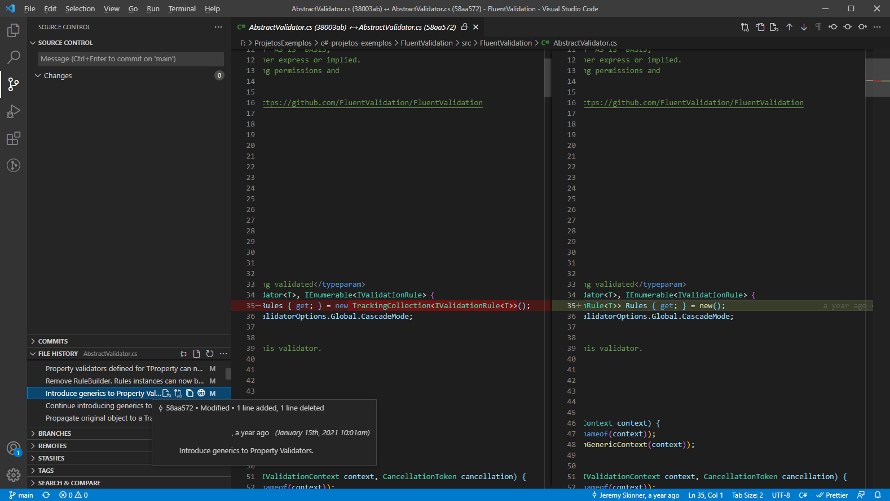

Hoje é dia de estudar o projeto <a href="https://github.com/FluentValidation/FluentValidation">FluentValidation/FluentValidation</a>, uma biblioteca simples se comparada com o EFCore, mas acredito que a vamos conseguir extrair alguns padrões interessantes com seu código.

## AbstractValidator.cs
`AbstractValidator` é a classe abstrata principal que declara as validações de um determinado modal.

`src/FluentValidation/AbstractValidator.cs`
```csharp
#region License
// Copyright (c) .NET Foundation and contributors.
// ...
#endregion
namespace FluentValidation {
	using System;
	using System.Collections.Generic;
    /** ... **/

    public abstract class AbstractValidator<T> : IValidator<T>, IEnumerable<IValidationRule> {
        /** ... **/
        internal TrackingCollection<IValidationRuleInternal<T>> Rules { get; } = new();

        /** .. **/
        ValidationResult IValidator.Validate(IValidationContext context) {
			context.Guard("Cannot pass null to Validate", nameof(context));
			return Validate(ValidationContext<T>.GetFromNonGenericContext(context));
		}

        /** .. **/
        public IEnumerator<IValidationRule> GetEnumerator() {
            return Rules.GetEnumerator();
        }

        IEnumerator IEnumerable.GetEnumerator() {
            return GetEnumerator();
        }
    }
}
```

## Analisando AbstractValidator.cs:
- <span style="color:#8bc34a;">O arquivo começa com um avisos de direitos autorais.</span>
> `“It is always a good idea to include copyright notices at the top of each source code file and to comment on your namespaces, interfaces, classes, enums, structs, methods, and properties. Your copyright comments should be first in the source file, above the using statements and take the form of a multiline comment that starts with /* and ends with */.” - Jason Alls`
- <span style="color:#ff7a8c;">Aqui é utilizado a antiga declaração de namespace, e as instruções de using estão dentro do namespace, estranho né?</span>
- <span style="color:#8bc34a;">O método `IValidator.Validate(context)` retorna um `ValidationResult`.</span>

- <span style="color:#8bc34a;">A classe implementa `IValidator<in T>` e `IEnumerable` explicitamente(mas também implicitamente). EF Core fez o mesmo, aparentemente isso está se tornando um padrão, força o usuário a não declarar variáveis de tipos concretos(classes).</span>
- <span style="color:#8bc34a;">`IValidator<in T>`(a versão genérica) permite utilizar interfaces em injeções de dependência. A interface `IValidator` (não genérica) existe também.</span>
```csharp
public class Startup
{
    /** ... **/
    public void ConfigureServices(IServiceCollection services)
    {
        /** ... **/
        services.AddScoped<IValidator<User>, UserValidator>();
    }
}
```
- <span style="color:#8bc34a;">`AbstractValidator<T>` é uma classe abstrata, portanto não pode ser instânciada. No EF Core a classe de inicialização é a `DbContext.cs`, no entanto não é abstrata.</span>
> `Typically you create a class that derives from DbContext and contains DbSet<TEntity> properties for each entity in the model. (EF Core)`
- <span style="color:#8bc34a;">`TrackingCollection` é instânciado utilizando a nova sintaxe `new()`.</span>


- <span style="color:#8bc34a;">A verificação por parâmetros nulos ou vazios é feita pelo método de extensão `ExtensionsInternal.Guard(this object obj, string message, string paramName)` (parecido com o `Check.NotNull()` do EF Core). Os métodos da classe `ExtensionsInternal` são `internal`, só podem ser utilizadas dentro da mesma assembly/dll.</span>

## ValidationResult.cs
`ValidationResult` é a classe que representa o resultado de uma validação.

`src/FluentValidation/ValidationResult.cs`
```csharp
[Serializable]
public class ValidationResult {
    private readonly List<ValidationFailure> _errors;

    /** ... **/
    public List<ValidationFailure> Errors => _errors;

    /** ... **/
    public ValidationResult() {
        _errors = new List<ValidationFailure>();
    }
}
```

## Analisando ValidationResult.cs:
- <span style="color:#8bc34a;">O campo `_errors` é readonly, sendo possível atribuir apenas no construtor.</span>
> `“We are now going to look at an immutable object. The Person object in the following code has three private member variables. The only time these can be set is during the creation time in the constructor. Once set, they are unable to be modified for the rest of the object's lifetime.” - Jason Alls`
- <span style="color:#ff7a8c;">O problema é que a propriedade `Errors` remove o encapsulamento, sendo possível adicionar ou remover elementos da lista (mas não atribuir outra), não seria melhor transformar a lista pro tipo `ReadOnlyCollection<T>`?</span>
> `“When you create an immutable type and use object validation, you have a valid object for the lifetime of that object. Immutable types are predictable and do not change, you are not going to be in for any nasty surprises. This makes immutable types ideal for sharing between threads as they are thread-safe and there is no need for defensive programming.” - Jason Alls`
- <span style="color:#8bc34a;">O atributo `[Serializable]` permite a serialização do objeto .</span>

## Considerações finais
- Permitir acessos aos dados apenas por métodos ou propriedades.
- Escrever objetos/estruturas imutáveis (readonly).
- Manter métodos com a menor quantidade de parâmetros possíveis (máximo 3).
- Métodos com muitos parâmetros podem ser substituidos por um objeto.
- Evitar código duplicado.