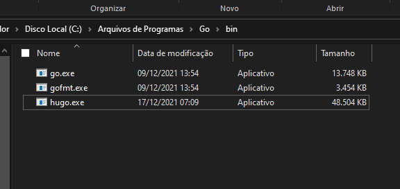
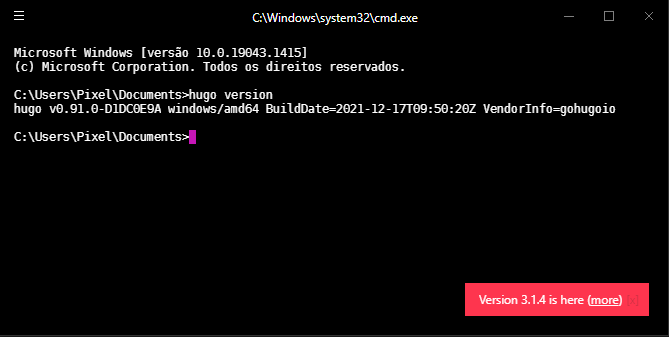
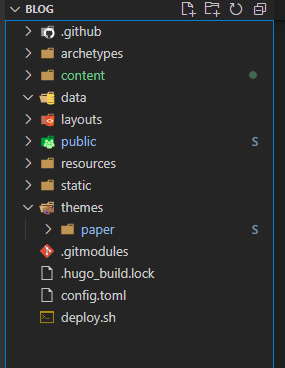
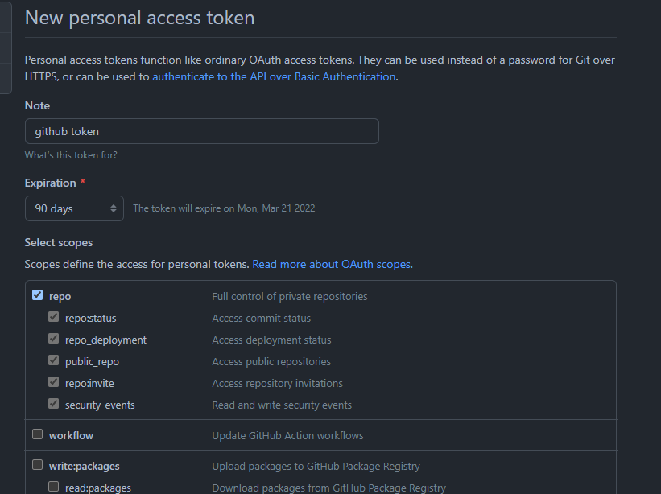
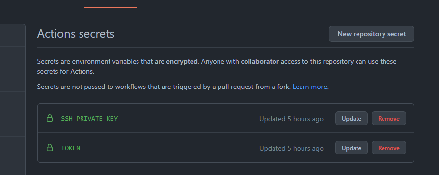

<br><br>
Hoje decidi criar um blog, mais uma de minhas loucuras (quem diria?).

Eu resolvo diferentes problemas relacionados à programação no meu dia-a-dia, então decidi criar este blog para expor as dificuldades que tive para chegar em um resultado positivo para esses obstáculos.

Gostaria de mencionar que escrever nunca foi meu forte, eu passo o meu dia apenas digitando palavras-chaves (ou quem sabe um JSDoc?), mas vou tentar escrever os posts de uma maneira fácil para que todos entendam.

## Enfim, vamos ao que importa, como criei esse blog?

Aparentemente, no ambiente do <a href="https://go.dev/">Go Language</a> existe um framework muito famoso chamado `Hugo` (nome de gente? vou criar o `Rafael`), e ele é bastante utilizado para criação de websites estáticos.

## 1° Passo: Instalar o GoLang e Hugo Framework

- Você pode baixar o GoLang direto do site: https://go.dev/
- Instalar o `Hugo` é um pouco mais complicado porque seu executável precisa estar em uma pasta definida nas suas variáveis de ambiente, então simplesmente joguei na pasta do GoLang:



Verifique se está tudo ok:



## 2° Passo: Criação dos repositórios

Dividi o projeto em dois repositórios no GitHub: o back-end e o front-end.

Back-end: `RafaelMFonseca/rafaelmfonseca.blog`

Front-end: `RafaelMFonseca/rafaelmfonseca.github.io`


Antes de tudo iniciei o repositório do back-end com CLI do hugo:

```
$ hugo new site rafaelmfonseca.blog
$ cd rafaelmfonseca.blog
$ git init
$ git submodule add https://github.com/nanxiaobei/hugo-paper themes/paper
$ hugo server
$ git submodule add -b main git@github.com:RafaelMFonseca/rafaelmfonseca.github.io public
```



Observe que adicionei dois submódulos do git, o primeiro sendo o tema principal: `nanxiaobei/hugo-paper` (pasta themes), e segundo o módulo onde os arquivos compilados serão jogados: `RafaelMFonseca/rafaelmfonseca.github.io` (pasta public).

## 3° Passo: Configuração do blog

Abra o arquivo `config.toml` e altere as propriedades de acordo com o tema selecionado.
Veja o meu de exemplo:

```
baseURL = 'https://rafaelmfonseca.github.io/'
languageCode = 'en-us'
title = 'Rafael Moreira Fonseca'
theme = 'paper'
```

## 4° Passo: Breve resumo do Hugo CLI

Provavalmente você não vai utilizar os comandos abaixo se configurar para realizar build automática pelo GitHub Actions, mas só por curiosidade:

Para compilar o arquivos:
```
$ hugo
```
Para iniciar o servidor de dev:
```
$ hugo server
```

## 5° Passo: Build automática pelo GitHub Actions

Vamos utilizar o GitHub Pages justamente para hospedar uma aplicação compilada com o `Hugo` e o GitHub Actions para automatizar sua build.

O workflow vai ser mais ou menos isso:

<b> Commit na branch `RafaelMFonseca/rafaelmfonseca.blog` => GitHub Actions => Branch `RafaelMFonseca/rafaelmfonseca.github.io` atualizada com os arquivos estáticos do blog</b>

Crie em seu repositório do back-end o seguinte arquivo: `.github/workflows/main.yml` com o conteúdo:

```yaml
name: CI
on: push
jobs:
  deploy:
    runs-on: ubuntu-latest
    steps:
      - name: Git checkout
        uses: actions/checkout@v2
        with:
            ssh-key: ${{ secrets.SSH_PRIVATE_KEY }}
            persist-credentials: true
            submodules: true

      - name: Update theme
        uses: snickerbockers/submodules-init@v4

      - name: Setup hugo
        uses: peaceiris/actions-hugo@v2
        with:
            hugo-version: "0.85.0"

      - name: Build
        run: hugo --minify

      - name: Deploy
        uses: peaceiris/actions-gh-pages@v3
        with:
            personal_token: ${{ secrets.TOKEN }}
            external_repository: <nomeusuario>/<nomeusuario>.github.io
            publish_dir: ./public
            keep_files: false
            user_name: <nomeusuario>
            user_email: <emailvalido>
            publish_branch: main
            force_orphan: true
```

## 6° Passo: Configurações de token

Note que no YAML estamos utilizando duas variáveis: SSH_PRIVATE_KEY e TOKEN.

O TOKEN é gerado pelo link: https://github.com/settings/tokens/new



E para declarar essas variáveis adicionamos em: https://github.com/nomeusuario/seurepositorio/settings/secrets/actions



O SSH_PRIVATE_KEY é sua chave SSH gerada para o GitHub.

Com isso qualquer commit vai disparar o GitHub Actions e publicar seu blog no repositório de front-end.