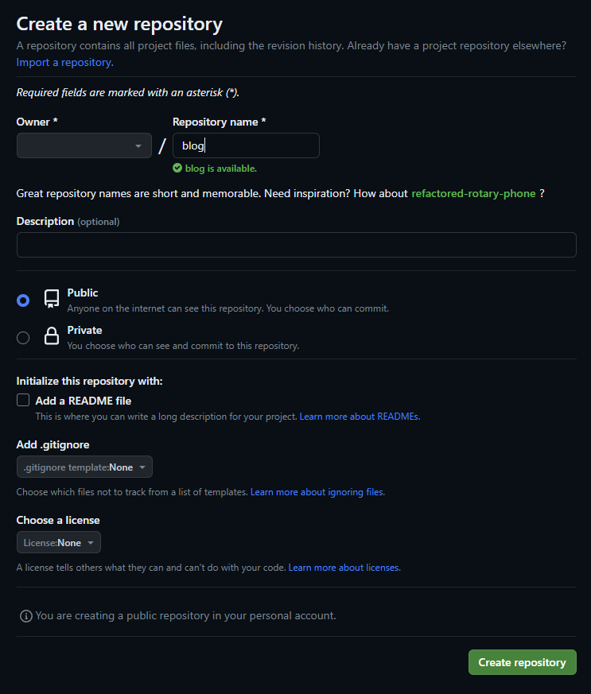
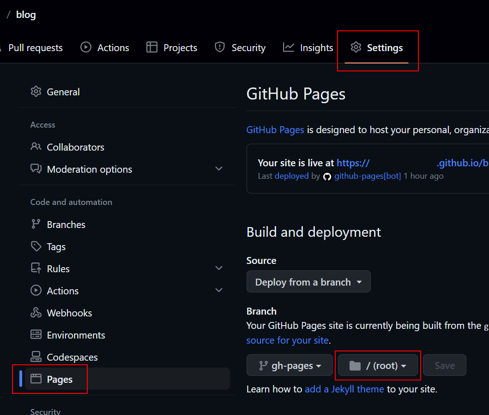
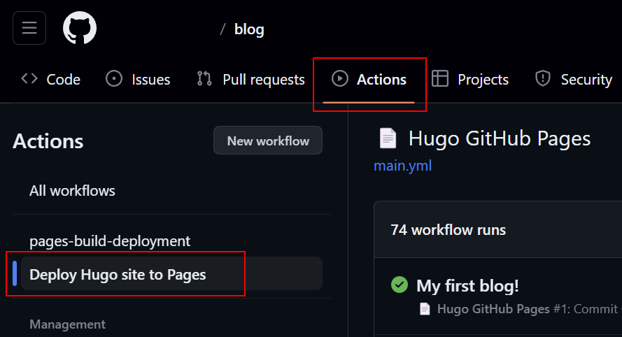

# O que é a ferramenta "Hugo"?

Hugo é um gerador de website estáticos escrito em [Golang](https://go.dev/), otimizado para ser rápido e fácil de se configurar. Hugo busca o conteúdo e templates do seu repositório para renderizá-los em um site totalmente estático (HTML/CSS/JS). Com ele você consegue criar posts e páginas em formato Markdown e em conjunto com o GitHub conseguimos hospedar nosso website de forma gratuita e automática sem muita preocupação.

## Sobre o GitHub Pages

GitHub Pages é um serviço de hospedagem do [GitHub](https://github.com/) para sites estáticos que utiliza arquivos de um ou mais repositórios do GitHub para realizar a publicacão do website. Ao publicar com o Pages, o GitHub fornece o endereço `http(s)://<nome_usuario>.github.io/<nome_repositorio>` para que você consiga acessar o site pela internet.

## Pré-requisitos

- Ter uma conta no [GitHub](https://github.com/).
- Instalar o Git.
- Instalar o Hugo:

```
choco install hugo-extented -y
```

## 1° Passo: Criação do repositório no GitHub

Precisamos criar nossa branch que vai ser responsável por armazenar todos os arquivos do blog, incluindo os posts, páginas e o tema. Selecione **Public** na visibilidade do repositório, o GitHub Pages não permite publicar com a opção **Private**.

<center></center>

## 2° Passo: Criação do blog

Agora conseguimos utilizar a CLI do Hugo para criar a estrutura do blog e acrescentar o submódulo `nanxiaobei/hugo-paper` na pasta themes.

```
hugo new site blog
cd blog
git init
git submodule add https://github.com/nanxiaobei/hugo-paper themes/paper
hugo server
```

- **Observação:** O tema `paper` é uma sugestão, pode ser qualquer outro, [veja aqui todos os temas disponíveis](https://themes.gohugo.io/) que a comunidade criou.

<center></center>

## 3° Passo: Configuração do blog

Já que o repositorio se chama `blog`, isso significa que o GitHub Pages vai expor as páginas do website no endereço: `https://<nome_usuario>.github.io/blog`, portanto precisamos ajustar as configurações para que o Hugo entenda que a diretório raiz do website começa em `/blog`.
Edite o arquivo `config.toml` e ajuste as propriedades:

```
baseURL = 'https://<nome_usuario>.github.io/blog'
languageCode = 'en-us'
title = 'Nome'
theme = 'paper'
```


## 5° Passo: Build automática pelo GitHub Actions

Crie o arquivos `.github/workflows/hugo.yaml` no seu repositório local. Ele vai ser responsável por compilar os arquivos de nosso blog e publicar no GitHub Pages:


```yaml
name: Deploy Hugo site to Pages

on:
  push:
    branches:
      - main

jobs:
  deploy:
    runs-on: ubuntu-latest
    steps:
      - name: Checkout
        uses: actions/checkout@v3
        with:
          submodules: true
          fetch-depth: 0

      - name: Setup Hugo
        uses: peaceiris/actions-hugo@v2
        with:
          hugo-version: '0.110.0'

      - name: Build Hugo
        run: hugo --minify

      - name: Deploy
        uses: peaceiris/actions-gh-pages@v3
        if: github.ref == 'refs/heads/main'
        with:
          personal_token: ${{ secrets.GITHUB_TOKEN  }}
          publish_dir: ./public

```

- **Observação:** Vale notar que o secret **"GITHUB_TOKEN"** não é um Personal Access Token. O GitHub Actions cria esse secret automaticamente antes da Action ser executada, então você pode realizar o deploy sem se preocupar com isso.

## 6° Passo: Configurando o GitHub Pages

No GitHub, navegue até as **configurações** de seu repositório e defina o diretório root e branch para o seu blog.

<center></center>

## 7° Passo: Publicando o blog

Agora basta commitar e enviar os arquivos do repositório para o GitHub. Com isso a Action será disparada automaticamente.

Você consegue visualizar o andamento do Workflow no menu **"Action"**:

<center></center>

## Opcional: Testando localmente

Hugo CLI fornece alguns comandos úteis para conseguir visualizar e compilar o blog localmente, sem a necessidade de publicar os arquivos para o GitHub Pages.


### Para compilar o arquivos:
```
$ hugo
```

### Para iniciar o servidor de desenvolvimento:
```
$ hugo serve
```

Tudo pronto!

Agora você consegue acessar o seu blog através de um endereço na internet e tem a possibilidade de adicionar mais conteúdo para personalizar o blog.

Apareceu alguma dúvida? Envie nos comentários abaixo.