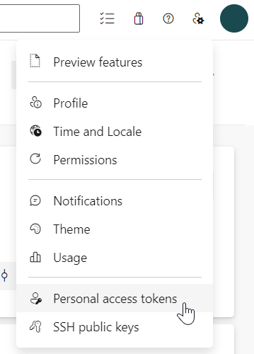
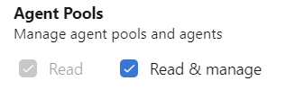
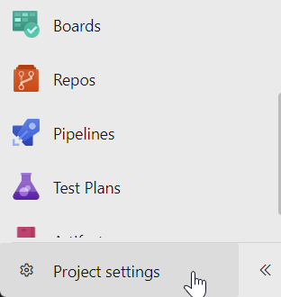
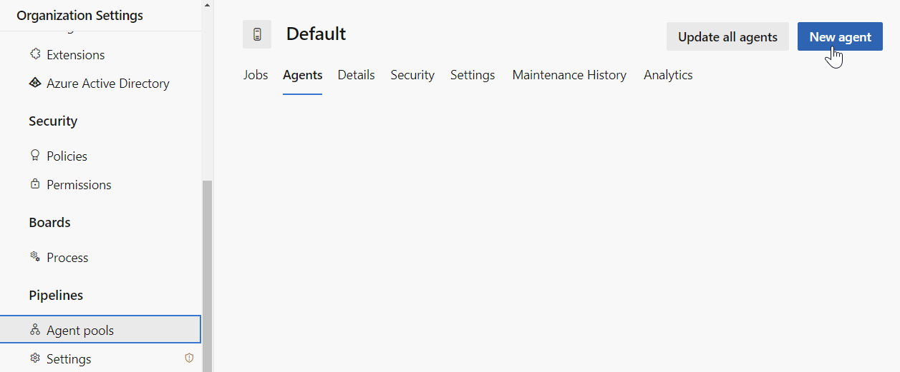
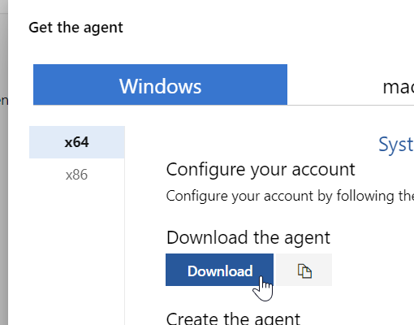
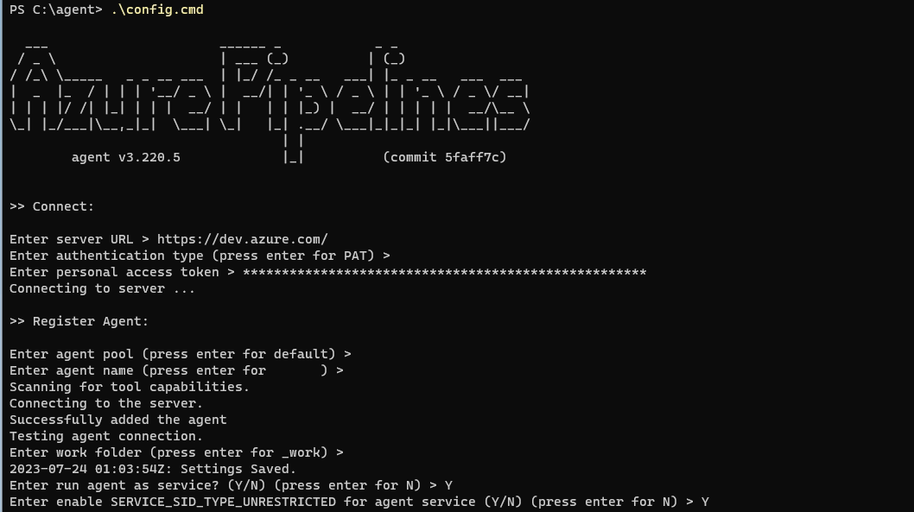
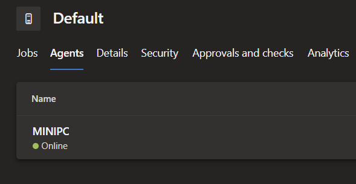
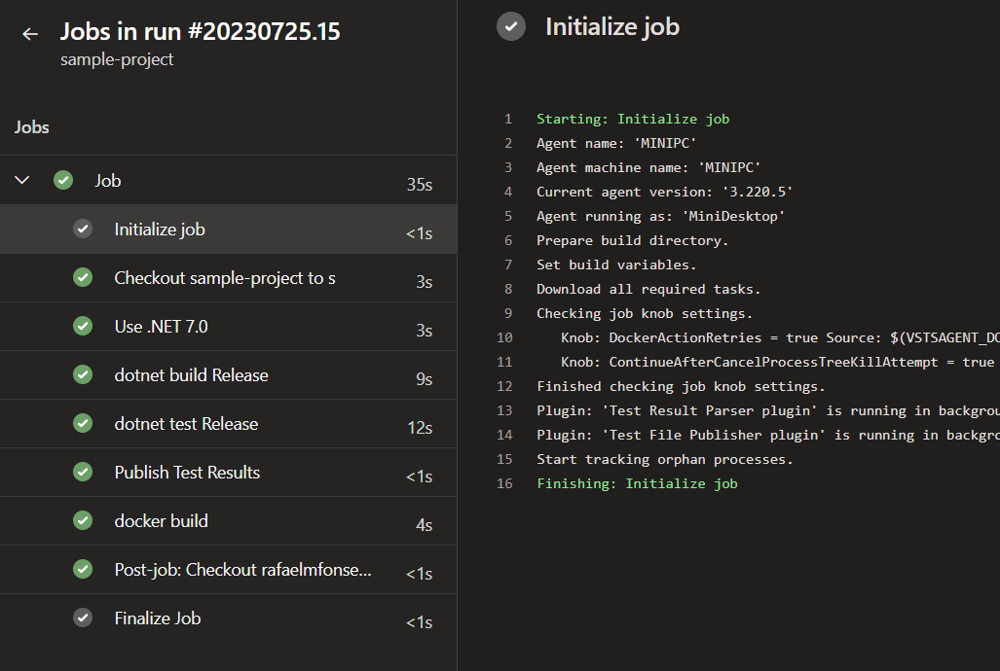

Para realizar a build ou o deploy de sua aplicação no Azure Pipelines, você precisa ter disponível pelo menos um Agent do Azure DevOps para realizar esta tarefa.
Mas e se você quisesse personalizar o seu próprio Agent ao invés de usar o que a Microsoft fornece?

Pra isso, você pode utilizar Agents Self-Hosted para executar workflows em qualquer infraestrutura sua, seja ela uma máquina local (on-premises) ou na nuvem.

## O que é um Agent?

Um Agent é um Software responsável por executar tarefas disparadas pelo Azure DevOps.

Para isso você tem duas opções:
- **Microsoft-hosted agents (recomendado):** Agents pré-definidos pela Microsoft, com eles você não precisa se preocupar com manutenção ou atualizações. É o jeito mais fácil de conseguir rodar suas pipelines. [Porém, os Agents da Microsoft demoram um pouco mais para iniciar e são destruídos toda vez que as builds/releases são completadas.](https://learn.microsoft.com/en-us/azure/devops/pipelines/agents/agents?view=azure-devops&tabs=browser#private-agent-performance-advantages)
- **Self-hosted agents:** Agents instalados no seu servidor e configurado por você mesmo.

# Instalando e Configurando um Agent (Windows)

Você consegue instalar um Agent em máquinas Linux, Windows ou MacOS.Inclusive, é possível instalar até em um container do Docker.

## Gerando um PAT (Personal Access Token) para o Agent

O primeiro passo antes de configurar um Agent é criar um Personal Access Token com as permissões necessárias para o Agent consiga se conectar com a Pipeline.

- Acesse o menu de PAT.



- Crie um novo Personal Access Token apenas com permissão para "Agent Pools (Read & Manager)".



## Instalando um novo Agent

Agora que já criamos o Personal Access Token, podemos seguir para a configuração do Agent.

- Acesse as configurações do projeto.



- Vá até **Agent Pools > Default > Agents**.
- Clique em **New Agent**.



- Faça download do Agent. Por padrão, o arquivo vai ser baixado na pasta "Downloads", deixe lá.



- Execute o **Powershell como Administrador**, navegue até o diretório raiz **C:/** e crie a pasta "agent".
```ps1
mkdir agent ; cd agent
```
- Faça extração do arquivo .zip instalado:
```ps1
Add-Type -AssemblyName System.IO.Compression.FileSystem ; [System.IO.Compression.ZipFile]::ExtractToDirectory("$HOME\Downloads\vsts-agent-win-x64-3.220.5.zip", "$PWD")
```
> **Observação:** execute o comando que aparece na tela do Azure DevOps, o trecho acima pode estar desatualizado.
- Configure o Agent:
```ps1
.\config.cmd
```
- É importante prestar atenção em algumas perguntas que a instalação vai fazer, você deve responder de acordo com suas necessidades, mas vou mostrar como respondi:

| Comando | Resposta | 
| --- | --- |
| Enter server url | https://dev.azure.com/<nome_organizacao> | 
| Enter authentication type | Enter | 
| Enter personal access token | (Preencher com seu PAT, ver abaixo como gerar um) | 
| Enter agent pool | Enter | 
| Enter agent name | Enter | 
| Enter work folder | Enter | 
| Enter run agent as service? | N |

- Copie o token e cole na instalação do Agent.

- Conclusão da instalação:



> **Observações:** a Microsoft recomenda a instalação de apenas um Agent por máquina. Não seguir essa recomendação pode afetar a performance e o resultado da execução de sua pipeline.

## Executando o Agent

Caso você não configurou o Agent para rodar como serviço, basta executar o arquivo `run.cmd` para iniciá-lo.

```
.\run.cmd
```

Navegando de volta para a página de Agent Pools, você pode ver o novo Agent na pool Default:



# Editando a definição da pipeline para utilizar o novo Agent

Agora que o Agent está pronto, precisaremos configurar a pipeline para utilizá-lo.
No arquivo de definição da pipeline, altere a pool para "Default" e substitua "NOME_DO_SEU_AGENT" pelo nome do Agent que foi configurado. 

**azure-pipelines.yml**
```
trigger:
- main

pool:
  name: Default
  demands:
    - agent.name -equals NOME_DO_SEU_AGENT
```

Agora, vamos executar a Pipeline e abrir o passo "Initialize Job" para visualizar qual Agent a Pipeline escolheu:



É isso! Conseguimos configurar o nosso Agent e fazer com que nossa pipeline entenda que ele exista, e sem a necessidade de criar uma abertura no firewall da sua infraestrutura! Caso surgir alguma dúvida, sinta-se livre para perguntar nos comentários.