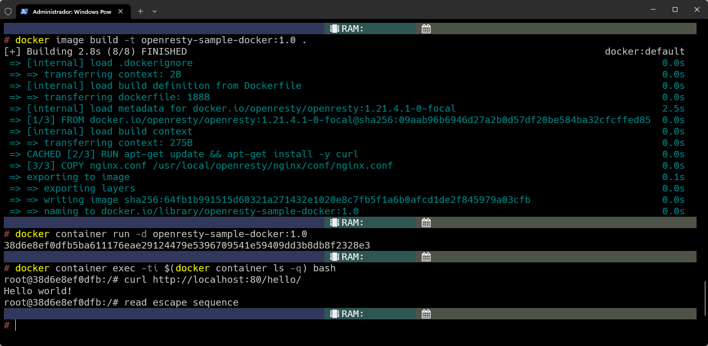
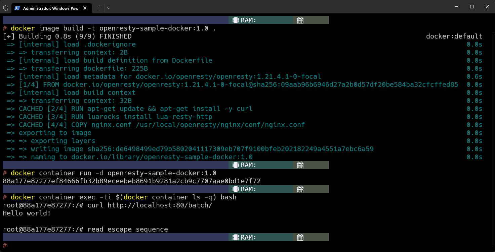

# Sobre o OpenResty

Já imaginou ter a possibilidade de manipular o tráfego do NGINX de uma forma mais dinâmica com alguma linguagem de programação? É aí que entra o OpenResty, uma plataforma que combina o NGINX com a linguagem Lua.

Por exemplo, você consegue customizar o tráfego do NGINX incluindo trechos de código Lua diretamente no arquivo de configuração, além de conseguir instalar outros módulos usando o [luarocks](https://luarocks.org/). Com o OpenResty, também conseguimos criar um API Gateway robusta, com a possibilidade de implementar autenticações, rate limiting, cache e entre outros.

## OpenResty com Docker

Nesse tutorial, vamos configurar uma aplicação OpenResty e aprender a executá-lo em um container Docker. Também demonstraremos como criar um endpoint com a linguagen Lua que irá retornar uma mensagem simples.

### Pré-requisitos

- [Docker](https://www.docker.com/)

## Configurando o Dockerfile

OpenResty fornece várias imagens Docker para utilizar em suas aplicações, neste exemplos vamos optar pela distribuição `focal`, com a tag `openresty/openresty:1.21.4.1-0-focal`.

```Dockerfile
FROM openresty/openresty:1.21.4.1-0-focal

RUN apt-get update && apt-get install -y curl

COPY nginx.conf /usr/local/openresty/nginx/conf/nginx.conf
```
No arquivo acima, não especificamos o `CMD`, dessa forma o Dockerfile irá herdar o comando do próprio `openresty`. Além disso, foi incluído a instrução `RUN` para instalar a ferramenta `curl`, vamos testar os endpoints do NGINX posteriormente. Agora com o Dockerfile pronto, o próximo passo é criar o arquivo `nginx.conf` antes de compilar a imagem.

## Definindo a configuração do Nginx

Antes de personalizar os endpoints,  vamos começar com uma aplicação bem simples e com uma configuração mínima para funcionar: o NGINX vai escutar a porta 80 e responder "Hello World!" para qualquer requisição feita para a rota `/hello/`. Crie o seu arquivo `nginx.conf` na pasta raiz e adicione o seguinte trecho de código:

```nginx
events {
    worker_connections  4096;
}

http {
    server {
        listen 80;
        charset utf-8;

        location = /hello/ {
            content_by_lua '
                ngx.say("Hello world!")
            ';
        }
    }
}
```

## Processo de build e execução do container

Com o arquivo `Dockerfile` tudo certo, vamos criar nossa imagem com a tag `openresty-sample-docker:1.0` e executar o container em modo `detached`, ou seja, em segunda plano.

```bash
# Realiza o build da imagem a partir do Dockerfile na pasta atual
docker image build -t openresty-sample-docker:1.0 .

# Inicia o container em modo "detached"
docker container run -d openresty-sample-docker:1.0
```

## Conectando no container

Para confirmar se o NGINX está conseguindo processar e responder as mensagens de acordo com as configurações do arquivo `nginx.conf`, basta enviar uma requisição utilizando o `curl` para `http://localhost:80/hello/`.

```bash
# Executa o Bash em modo interativo no container
docker container exec -ti $(docker container ls -q) bash

# Envia requisição para o servidor NGINX
curl http://localhost:80/hello/

# Envia comando de dettach sem finalizar o container
CTRL + P + Q
```

Se tudo correr bem, devemos ver um output semelhante ao exemplo abaixo:



# Funcionalidades dos módulos Lua

Com os módulos do Lua, conseguimos realizar diversas tarefas como: manipular requisições, converter formatos como JSON ou XML, entre outros. Além disso, o NGINX disponibiliza sua API no contexto Lua através da variável global `ngx`. No exemplo abaixo vamos acrescentar o endpoint `/batch/`, que tem como objetivo enviar uma requisição para `/hello/` e retornar sua resposta.

Pra fazer isso, precisamos editar o `nginx.conf` um pouco:

```nginx
events {
    worker_connections  4096;
}

http {
    server {
        listen 80;
        charset utf-8;

        location = /hello/ {
            content_by_lua '
                ngx.say("Hello world!")
            ';
        }

        location = /batch/ {
            content_by_lua '
                local http = require "resty.http"

                local httpc = http.new()

                httpc:connect({
                    scheme = "http",
                    host = "127.0.0.1",
                    port = ngx.var.server_port
                })

                local res, err = httpc:request {
                    path = "/hello/",
                    method = "GET"
                }

                if not res then
                    ngx.status = 500
                    ngx.say("Error fetching: ", err)
                else
                    local body = res:read_body()

                    ngx.status = res.status
                    ngx.say(body)
                end
            ';
        }
    }
}
```

Também vamos precisar alterar o `Dockerfile` para incluir a instalação do módulo que estamos usando para realizar as requisições, o `resty.http`:

```Dockerfile
FROM openresty/openresty:1.21.4.1-0-focal

RUN apt-get update && apt-get install -y curl

RUN luarocks install lua-resty-http

COPY nginx.conf /usr/local/openresty/nginx/conf/nginx.conf
```

Resultado:



Nesse post, vimos como criar uma aplicação OpenResty para estender a funcionalidade do NGINX, acrescentamos dois endpoints e realizamos uma simples requisição. Lembrando que as configurações mostradas nesse post não necessariamente segue as melhores práticas, mas o objetivo principal é mostrar as funcionalidades que o OpenResty pode proporcionar.

Apareceu alguma dúvida? Envie nos comentários abaixo.