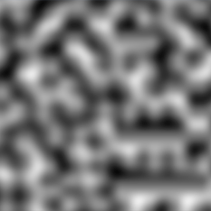

A geração procedural é um assunto que vem se popularizando nos últimos anos entre os desenvolvedores de jogos indies. <br>
A utilização dessa técnica para geração de leveis e terrenos de jogos é adotado por programadores que não desejam limitar o conteúdo de seus games, abrindo portas para criar uma quantidade infinita de recursos. Hoje, vamos discurtir as principais vantagens e desvantagens de usar esse tipo de técnica, e saber quando a utilização desses algorítmos pode se tornar favorável para o seu projeto.

## Afinal, o que são esses algoritmos procedurais?

É uma abordagem de junção de vários algoritmos e/ou dados aleatórios que são encadeados para gerar valores com formatos conhecidos e úteis. Um dos exemplos mais famosos é o cálculo do matemático Ken Perlin, o Perlin Noise, onde o seu resultado pode ser usado para criar imagens parecidas com essa:


<center><i style="font-size: 12px;">[Imagem gerada com perlin noise.]</i></center>

É importante observar que a imagem é composta por variações de apenas duas cores: preto e branco, **sendo a cor preta representado pelo valor 0.0f e a branca pelo valor 1.0f**. No game engine Unity, cada pixel pode ser gerado utilizando o método estático `Mathf.PerlinNoise(x, y)`, mas para isso você também deve informar as coordenadas x e y.

```csharp
using System;
using UnityEngine;
using UnityEngine.UI;

/// <summary>
/// Classe responsável por criar uma textura e preenchê-la com perlin noise.
/// Alterar o valor do campo "noiseScale" pode gerar resultados diferentes.
/// </summary>
public class GeracaoProcedural : MonoBehaviour
{
    [SerializeField] public RawImage image;
    [SerializeField] public int textureWidth = 256;
    [SerializeField] public int textureHeight = 256;
    [SerializeField] public float noiseScale = 30.0f;

    public void Start() => GenerateNoise();

    private void GenerateNoise()
    {
        var texture = new Texture2D(textureWidth, textureHeight);
        var colors = new Color32[texture.width * texture.height];

        for (int x = 0; x < texture.width; x++)
        {
            for (int y = 0; y < texture.height; y++)
            {
                float xCoord = x / noiseScale;
                float yCoord = y / noiseScale;
                byte noiseValue = (byte) (Mathf.PerlinNoise(xCoord, yCoord) * 255);

                colors[y * texture.width + x] = new Color32(noiseValue, noiseValue, noiseValue, 255);
            }
        }

        texture.SetPixels32(colors);
        texture.Apply();

        image.texture = texture;
    }
}
```

Imaginando o cenário de que o valor **1.0f** pode ser o ponto mais alto de uma montanha, o **Perlin Noise possibilita a geração de terrenos proceduralmente**:


<center><i style="font-size: 12px;">[Terreno configurado a partir do valores gerado pelo perlin noise.]</i></center>

## Em busca do realismo utilizando a combinações de algoritmos

Só o Perlin Noise não é suficiente, para tornar o cenário agradável aos olhos dos jogadores, a combinações de **noises** se torna crucial na criação de terrenos. Na imagem abaixo utilizei os algoritmos: **Perlin Noise**, **Erosion**, **Terrace** e **Shore Line**.


<center><i style="font-size: 12px;">[Terreno mais detalhado usando combinações de algoritmos.]</i></center>

## Mas todas essas combinações de algoritmos impactam na performance?

A geração procedural exige um alto processamento da CPU para realizar os cálculos em tempo de execução, principalmente se o terreno for gerado automaticamente em volta do Player. Utilizando as técnicas de otimizações corretas, como a divisão do terrenos em chunks (dividir um grande terreno em partes) e a aplicação de object pooling (reutilização de objetos descartados), é possível alcançar resultados em que o processamento fique imperceptível para o usuário. <br>


<center><i style="font-size: 12px;">[Terreno dividido em 9 partes (chunks).]</i></center>

## Geração procedural está presente em todo lugar

Os setores de efeitos visuais e videogames usam a geração procedural para a criação de materiais PBR e texturas 3D. <br>
Hoje, a Adobe lidera a indústria de criação de materiais com seu software premiado: Substance Designer. <br>
Essa ferramenta pode auxiliar e gerar variações infinitas de texturas através de nós interligados.


<center><i style="font-size: 12px;">[Textura de couro renderizado pelo Substance Designer]</i></center>

## Nem tudo é perfeito

Infelizmente, com o tempo, você pode notar padrões nas soluções procedurais, as repetições ficam claras e o ambiente pode não ser tão diverso. Para evitar que o jogador note demais essas estruturas repetitivas, cria-se uma necessidade de usar combinações de ambientes feitos à mão com ferramentas que utilizam algoritmos procedurais.


<center><i style="font-size: 12px;">[Repetição de objetos no planeta gerado proceduralmente pelo jogo "No Man's Sky".]</i></center>

### Vantagens
* Permite criar conteúdo dinamicamente.
* É possível a geração de terrenos gigantes e recursos infinitos.
* Alta reusabilidade, alterar apenas alguns valores e parâmetros pode gerar um novo conteúdo.

### Desvantagens
* O conteúdo gerado proceduralmente pode parecer repetitivo e entediante.
* A geração depende da potência do hardware.
* Exige mais conhecimento de programação.

## Conclusão

Por fim, esse artigo faz reflexão de que as ferramentas e algoritmos procedurais são técnicas incríveis na programação de jogos, isso ajuda automatizar a criação de certos dados. Vários jogos geram ambientes ou criaturas proceduralmente durante o produto final, mas vale você avaliar se o seu projeto se encaixa nessa categoria.
