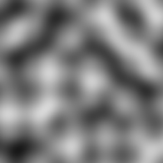
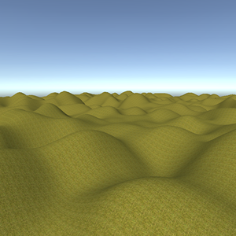
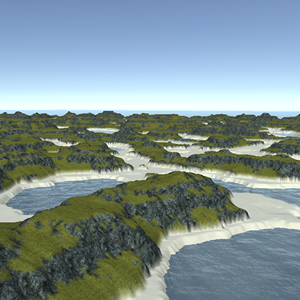
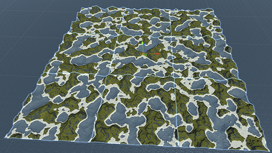
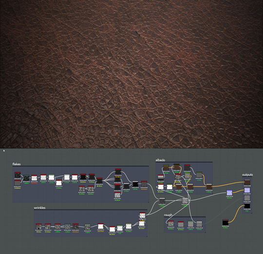
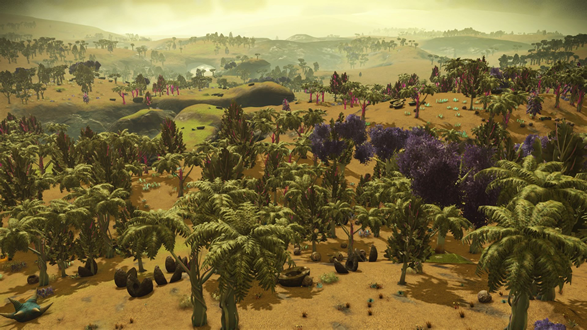

A geração procedural é um assunto que vem se popularizando nos últimos anos entre os desenvolvedores de jogos indies. <br>
A utilização de algoritmos procedurais para geração de leveis e terrenos de jogos é adotado por programadores que não desejam limitar o conteúdo de seus games, abrindo portas para criar uma quantidade infinita de recursos. <br>
Hoje, vamos discurtir as principais vantagens e desvantagens de usar esse tipo de técnica, e saber quando a utilização desses algorítmos pode se tornar favorável para o seu projeto.

## Afinal, o que são esses algoritmos procedurais?
Essa abordagem é a junção de vários algoritmos e/ou dados aleatórios que são encadeados para gerar valores com formatos conhecidos e úteis. <br>
A maneira mais fácil de demonstrar isso tudo é com exemplos, um dos cálculos matemáticos mais famosos é o **Perlin Noise** criado por Ken Perlin. Ao executar esse cálculo, o seu resultado pode ser usado para criar imagens parecidas com a abaixo:



É importante observar que a imagem é composta por variações de apenas duas cores: preto e branco, sendo a cor preta representado pelo valor **0.0f** e a branca pelo valor **1.0f**. <br>
No game engine Unity, cada pixel pode ser gerado utilizando o método estático `Mathf.PerlinNoise(x, y)`, mas para isso você também deve informar as coordenadas x e y.

```csharp
using UnityEngine;

float posX = 10;
float posY = 20;

float noise = Mathf.PerlinNoise(posX, posY);

Debug.Log("Noise: " + noise);
```

Imaginando o cenário de que o valor **1.0f** pode ser o ponto mais alto de uma montanha, o **Perlin Noise** possibilita a geração de terrenos proceduralmente:



## Em busca do realismo utilizando a combinações de algoritmos.

Só o Perlin Noise não é suficiente, para tornar o cenário agradável aos olhos dos jogadores, a combinações de **noises** se torna crucial na criação de terrenos. <br>
Na imagem abaixo utilizei os algoritmos: **Perlin Noise**, **Erosion**, **Terrace** e **Shore Line**.



## Performance

A geração procedural exige um alto processamento da CPU para realizar os cálculos em tempo de execução, principalmente se o terreno for gerado automaticamente em volta do Player. <br>
Utilizando as técnicas de otimizações corretas, como a divisão do terrenos em chunks e object pooling, é possível alcançar resultados em que o processamento fique imperceptível para o usuário. <br>



## Geração procedural está presente em todo lugar

Os setores de efeitos visuais e videogames usam a geração procedural para a criação de materiais PBR e texturas 3D. <br>
Hoje, a Adobe lidera a indústria de criação de materiais com seu software premiado: Substance Designer. <br>
Essa ferramenta pode auxiliar e gerar variações infinitas de texturas através de nós interligados.



## Nem tudo é perfeito

Infelizmente, com o tempo, você pode notar padrões nas soluções procedurais, as repetições ficam claras e o ambiente pode não ser tão diverso. Para evitar que o jogador note demais essas estruturas repetitivas, cria-se uma necessidade de usar a combinação de ambientes feitos à mão com ferramentas que utilizam algoritmos procedurais.



## Conclusão

Por fim, esse artigo faz reflexão de que as ferramentas e algoritmos procedurais são técnicas incríveis na programação de jogos, isso ajuda automatizar a criação de certos dados. Vários jogos gera ambientes ou criaturas proceduralmente durante o produto final, e vale você avaliar se o seu projeto se encaixa nessa categoria.
