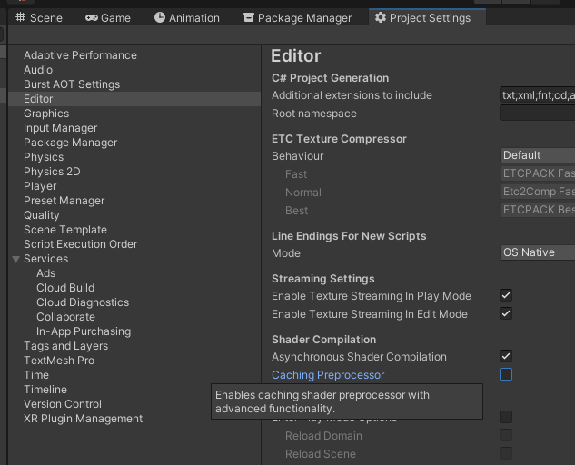
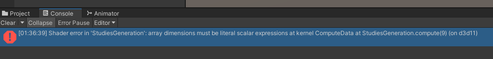
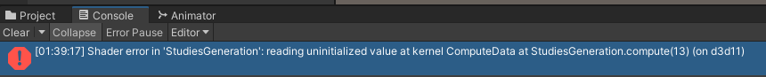
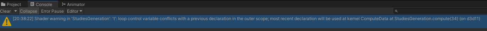
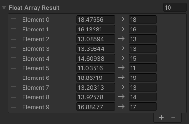

Não vou entrar em detalhes sobre a linguagem [HLSL](https://learn.microsoft.com/en-us/windows/win32/direct3dhlsl/dx-graphics-hlsl) (High-level shader language), talvez outro dia eu escreva mais sobre ele aqui, mas vou citar abaixo alguns pontos importante que (provavelmente) vou esquecer quando criar um arquivo *.compute lá em 2050.

# Desabilite o cache de processamento de shaders.

O Unity apontava vários erros que eu já tinha corrigido no Shader, mas o compilador não atualizava.<br>
**Desabilitar o checkbox abaixo resolveu:**



Links úteis:
- https://forum.unity.com/threads/compute-shader-undeclared-identifier-for-functions-and-variables-defined-in-include-files.1288592/#post-8167322

# "0 é int, 0.0 é float"

Básicão né? mas fiquei 10 minutos tentando entender porque meus cálculos não funcionavam.<br>

```c
int num = 5;

float result = 1.0 / (num - 1.0); // resultado = 0.25
float result = float(1) / (num - float(1)); // resultado = 0.25
float result = (float) 1 / (num - (float) 1); // resultado = 0.25
float result = 1 / (num - 1); // resultado = 0

int numInteger = 5;

float result = numInteger / 2; // resultado = 2
float result = numInteger / 2.0; // resultado = 2.5
float result = numInteger / float(2); // resultado = 2.5
float result = numInteger / float(2); // resultado = 2.5
float result = numInteger / (float) 2; // resultado = 2.5
```

# Arrays não podem ter dimensões definidas através de variáveis.

### [ERR_ARRAY_LITERAL: Array dimensions must be literal scalar expressions.](https://learn.microsoft.com/en-us/windows/win32/direct3dhlsl/hlsl-errors-and-warnings)

Não conseguimos definir a `length` do array através de variáveis, precisa ser uma expressão literal pro shader ser compilado(e com otimizações):



```c
float seu_array[30]; // OK!

float seu_array[size_array]; // ERRO!
```

Links úteis:
- https://stackoverflow.com/a/40957587
- https://learn.microsoft.com/en-us/windows/win32/direct3dhlsl/dx-graphics-hlsl-variable-syntax?redirectedfrom=MSDN

# Por precaução, sempre inicializar arrays se lidas posteriormente...



```c
RWStructuredBuffer<float> data;

#pragma kernel ComputeData
[numthreads(256, 1, 1)] void ComputeData(int index: SV_DispatchThreadID) {
    float terraces[30];

    for (int x = 0; x < 30; x++) { // Se remover este loop, o error acima é acionado.
        terraces[x] = 0.0;
    }

    if (index.x < 30) {
        data[index.x] = terraces[index.x];
    }
}
```

# Utilizar operações atômicas pra corrigir race condicions.

O título diz tudo, race condicion acontece quando uma ou mais threads podem acessar um dado compartilhado e tentam alterar o seu valor ao mesmo tempo.


```c
RWStructuredBuffer<int> data;

#pragma kernel ComputeData
[numthreads(256, 1, 1)] void ComputeData(int index: SV_DispatchThreadID) {
	data[0] = data[0] + 1; // ERRO DE RACE CONDITION!
	InterlockedAdd(data[0], 1); // OK, esta linha funciona!
}
```

Links úteis:
- https://stackoverflow.com/a/59365062
- https://stackoverflow.com/a/45527238

# Sempre declarar variáveis de loop com nomes diferentes:



```c
RWStructuredBuffer<int> data;

#pragma kernel ComputeData
[numthreads(256, 1, 1)] void ComputeData(int index: SV_DispatchThreadID) {
	for (int t = 0; t < 10; t++) {
	}

	for (int t = 0; t < 10; t++) { // Troque "t" por outra letra!
	}
}
```

# Resultado de funções

## [genType round(genType a);](https://developer.download.nvidia.com/cg/round.html)

