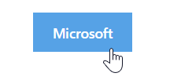
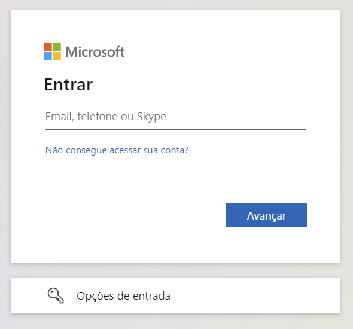
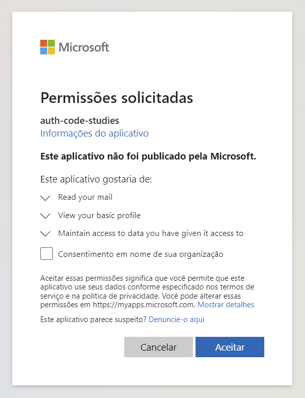
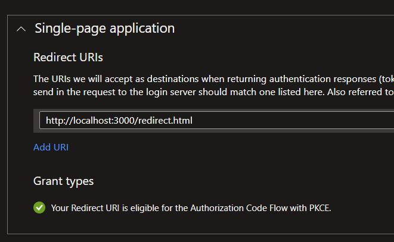

# OAuth 2

OAuth 2 é um protocolo de autorização que permite acessar dados do usuário em outro serviço (como Microsoft, Facebook e Github) sem a necessidade de compartilhar a senha. O objeito desse protocolo é fornecer diversos fluxos de autorização para aplicações web, dektops, mobile e outros dispositivos. Ao emitir tokens de curta duração, o OAuth 2 eleva a segurança, evitando a manipulação ou o armazenamento direto da senha do usuário.

# Termos do OAuth2

Antes da gente entrar de cara na explicação, vamos entender alguns termos que serão mencionados neste artigo:

- **Client:** Refere-se ao aplicativo que vai solicitar os dados do usuário (Exemplo: um frontend, um app mobile, etc).
- **Resource Owner:** Indica o usuário (ou máquina) que vai conceder (ou não) acesso ao seus dados.
- **Resource Server:** Diz respeito os serviços que hospedam os recursos protegidos. Pode ser um endpoint do backend ou um dos serviços da Azure (Ex: Microsoft Graph).
- **Authorization Server:** É o servidor responsável por gerar e processar o código de autorização, o qual é usado para obter o Access Token e Refresh Token. No exemplo abaixo, é a própria Microsoft.

# Fluxos de autorização

O OAuth 2, sendo uma especificação, descreve 4 fluxos diferentes para obter o Access Token, cada adequado para uma ocasião diferente.

- **Authorization Code:** O método mais completo e confiável de se realizar a autorização, suportado pela maioria das aplicações. Nesse fluxo o Authorization Server retorna um código temporário, que pode ser trocado para obter o Access Token.
- **Implicit:** Desenhado para funcionar apenas em navegadores, é similar ao fluxo Authorization Code, mas é inseguro e não recomendado. Neste fluxo o Access Token é retornado direto pelo Authorization Server, sem a utilização de um código temporário.
- **Resource Owner Password Credentials:** Usado quando o usuário fornece suas credenciais para o client realizar a autorização. Esse tipo é adequado para aplicações capazes de conseguir as credenciais do usuário (usuário e senha).
- **Client Credentials:** Utilizado para comunicações entre máquinas (server-to-server), ou por exemplo, em ferramentas de command-line. Nesse fluxo a interação do usuário não é necessária. (aqui o Client vai agir como um Resource Owner)

Cada fluxo merece o seu próprio artigo, por enquanto, vamos comentar e tentar entender apenas sobre o fluxo Authorization Code.

# Fluxo "Authorization Code"

O fluxo Authorization Code permite conceder dados de outro serviço sem que o usuário preencha suas credenciais no próprio client (seja ele um frontend, web app ou mobile). Para entender todo o processo que o Authorization Code faz, vamos olhar como um site poderia conectar em sua conta da Microsoft.

1) Solicitação de acesso: no seu frontend, o usuário clica em um botão pra se conectar com a Microsoft (endpoint "/authorize"):

<center></center>

**Observação:** O endpoint abaixo utiliza o método `plain` para o PKCE apenas para evitar boilerplate. O recomendado pela Microsoft é `SHA256`.

```html
<html>
    <head>
        <meta charset="UTF-8">
        <meta name="viewport" content="width=device-width, initial-scale=1.0">
        <script src="https://cdn.tailwindcss.com"></script>
        <title>Fluxo - Authorization Code</title>
    </head>
    <body class="p-5 flex justify-center">
        <button class="px-5 py-2 h-10 font-semibold text-sm bg-sky-500 text-white" onclick="auth()">
            Microsoft
        </button>
        <script type="text/javascript">
            function auth() {
                const url =
                    'https://login.microsoftonline.com/<TENANT_ID>/oauth2/v2.0/authorize?' +
                    'client_id=<CLIENT_ID>' +
                    '&response_type=code' +
                    '&response_mode=query' +
                    '&redirect_uri=' + encodeURIComponent('<REDIRECT_URI>') +
                    '&scope=' + encodeURIComponent('https://graph.microsoft.com/mail.read') +
                    '&code_challenge=12345678901234567890123456789012345678901234567890' +
                    '&code_challenge_method=plain';

                window.location.href = url;
            }
        </script>
    </body>
</html>
```

2) Redirecionamento para o serviço: o frontend redireciona o usuário para a página da Microsoft.

<center></center>

3) Permissões: após preencher as credenciais, será exibido em tela as permissões que o frontend está solicitando, o usuário pode aprovar ou negar conceder esses dados.

<center></center>

4) Se o usuário aprovar, a Microsoft redirecionará o usuário de volta para o frontend com o código de autorização. Esse código é temporário e na AzureAD ele [expira após 10 minutos](https://learn.microsoft.com/en-us/azure/active-directory/develop/v2-oauth2-auth-code-flow#successful-response). 

**Observação:** A URL de redirecionamento precisa ser reconhecida pela Azure AD, portanto precisamos cadastrar a Redirect URI no portal:

<center></center>

- No código de exemplo, a Microsoft vai redirecionar o usuário para o frontend com os seguintes URL Params:

```
http://localhost:3000/redirect.html?code={valor_code}&session_state={valor_session_state}
```

5) Agora é a hora de trocar o código temporário pelo Access Token.

```html
<html>
    <head>
        <meta charset="UTF-8">
        <meta name="viewport" content="width=device-width, initial-scale=1.0">
        <script src="https://cdn.tailwindcss.com"></script>
        <title>Fluxo - Authorization Code (Redirect)</title>
    </head>
    <body class="p-5 flex justify-center">
        <script type="text/javascript">
            const urlParams = new URLSearchParams(window.location.search);

            const code = urlParams.get('code');

            const requestBody = new URLSearchParams({
                client_id: '<CLIENT_ID>',
                scope: 'https://graph.microsoft.com/mail.read',
                redirect_uri: '<REDIRECT_URI>',
                grant_type: 'authorization_code',
                code_verifier: '12345678901234567890123456789012345678901234567890'
                code,
            });

            fetch('https://login.microsoftonline.com/<TENANT_ID>/oauth2/v2.0/token', {
                method: 'POST',
                headers: { 'Content-Type': 'application/x-www-form-urlencoded' },
                body: requestBody.toString()
            })
            .then(response => response.json())
            .then(data => {
                const accessToken = data['access_token'];
                console.log('Access Token: ' + accessToken);
            })
            .catch(error => console.error('Error:', error));
        </script>
    </body>
</html>

```

Sucesso!

No exemplo acima, vale notar que em nenhum momento o usuário e senha foram expostas no frontend, mas conseguimos gerar o Access Token para buscar informações do usuário. Isso é o que o OAuth2 viabiliza, além de trazer mais segurança para a aplicação.

Apareceu alguma dúvida? Envie nos comentários abaixo.