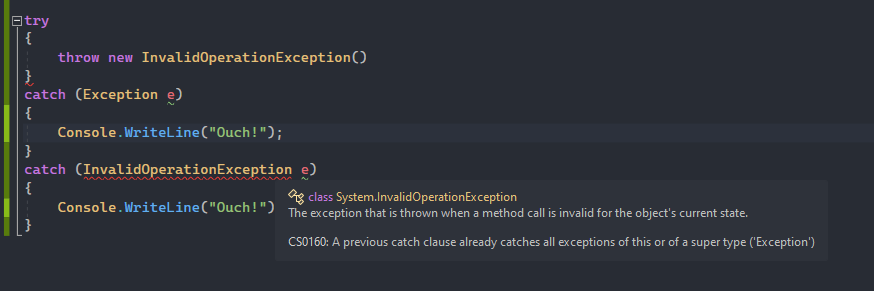
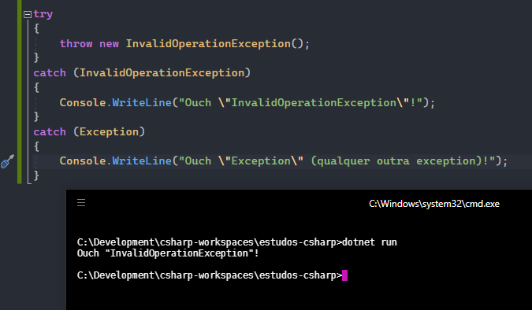
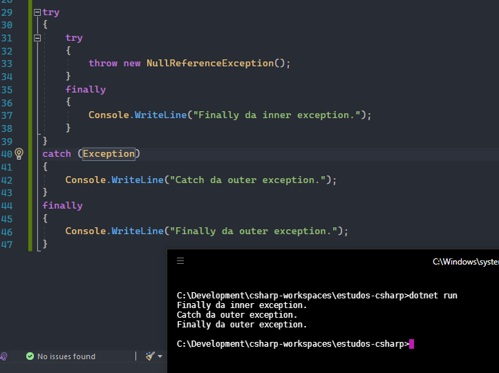

Quando devemos tratar exceções? Ou criar as nossas? E em que momento é apropriada relançá-las? O que são checked e unchecked exceptions?  
Esse post é mais uma tentativa de explorar os principais projetos .NET e buscar as melhores práticas sobre um tópico importante da programação orientada a objetos: as <b>Exceptions</b>.  
> "Exceções pode parecer um assunto simples, mas podemos escrever um livro só sobre isso."  
> (Eu, Mesmo)

Comecei lendo [a documentação da Microsoft](https://docs.microsoft.com/en-us/dotnet/standard/exceptions/best-practices-for-exceptions), realmente é um bom conteúdo, vamos lá:

> "In catch blocks, always order exceptions from the most derived to the least derived."

Entendo, devemos ordenar as exceções do mais derivado para o menos derivado, faz sentido, por exemplo, se o primeiro catch for do tipo `Exception`, ela já vai tratar todas as exceções possíveis.  

Errado:

(inclusive o VS avisa)

Correto:

- Todas exceções derivam de `System.Exception`.
- Quando uma Exception é lançada, a Common Language Runtime (CLR) procura pela instrução de catch the trata essa exceção, se o método atualmente em execução não conter um bloco catch, a CLR examinará o método que chamou o método atual, e assim por diante na pilha de chamadas.
- A CLR percorre os blocos catch na ordem fornecida até encontrar um tipo de exceção que corresponda à atual ou uma excepção herdada da excepção atual.

> "When your code cannot recover from an exception, don't catch that exception. Enable methods further up the call stack to recover if possible."

Bem, no final vamos precisar tratar de qualquer jeito né? mas vamos deixar a responsabilidade pra classe correta, essa deve ser a mensagem que a documentação da microsoft quer passar.

> "Clean up resources allocated with either using statements, or finally blocks. Prefer using statements to automatically clean up resources when exceptions are thrown. Use finally blocks to clean up resources that don't implement IDisposable. Code in a finally clause is almost always executed even when exceptions are thrown."

A regra é, a classe implementa `IDisposable`? então utilize a instrução `using`, caso contrário limpe os recursos no bloco `finally`, não tem erro.

- Códigos na instrução `finally` são sempre executados mesmo quando exceptions são lançadas: 

- Observe que o bloco `finally` foi executado mesmo sem o `catch`.
- Veja alguns casos em que o bloco `finally` não será executado:
- - Se a thread executando o bloco try-catch-finally é eliminada ou interrompida.
- - Se você utilizar `Environment.FailFast()`.
- - Se o hardware ficar inutilizável.
- - Se ocorrer uma falha de energia.
