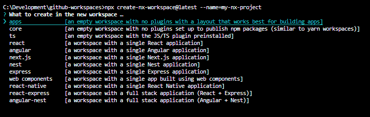
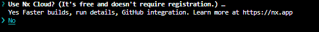

<div style="text-align: center;">
  
</div>

<br>

Nesse tutorial, vamos aprender como utilizar o NX para construir aplicações full-stack usando tecnologias modernas.

## Criando um novo workspace

Vamos iniciar nosso projeto Nx criando um workspace com o preset "npm", com o objetivo de futuramente publicar nosso pacote no npm.

```
npx create-nx-workspace@latest --name=my-nx-project --preset=npm
```

Se você não indicar o preset, o nx vai listar pra você alguns presets disponíveis para criar o projeto, e mesma coisa com o nome.



Também precisamos escolher se vamos utilizar a integração com o Nx Cloud para melhorar o cacheamento do projeto, acredito não ser necessário por conta do projeto ser simples.



## Generators

Generator são comandos que criam ou modificam arquivos do seu projeto de acordo com uma collection, no próximo passo, vamos usar a collection `@nrwl/angular:library` para construir uma biblioteca Angular.

## Construindo bibliotecas

Primeiro, é necessário instalar o plugin do Angular com o Nx CLI:
```
npm install @nrwl/angular --save-dev
```

Agora, para gerar os arquivos da biblioteca no nosso projeto Nx, vamos precisar executar o comando abaixo:
```
npx nx generate @nrwl/angular:library --name=my-lib --buildable
```

## Executando os testes

```
npx nx run-many --target=test --all
```

## Compilando o projeto

```
npx nx run-many --target=build --all
```